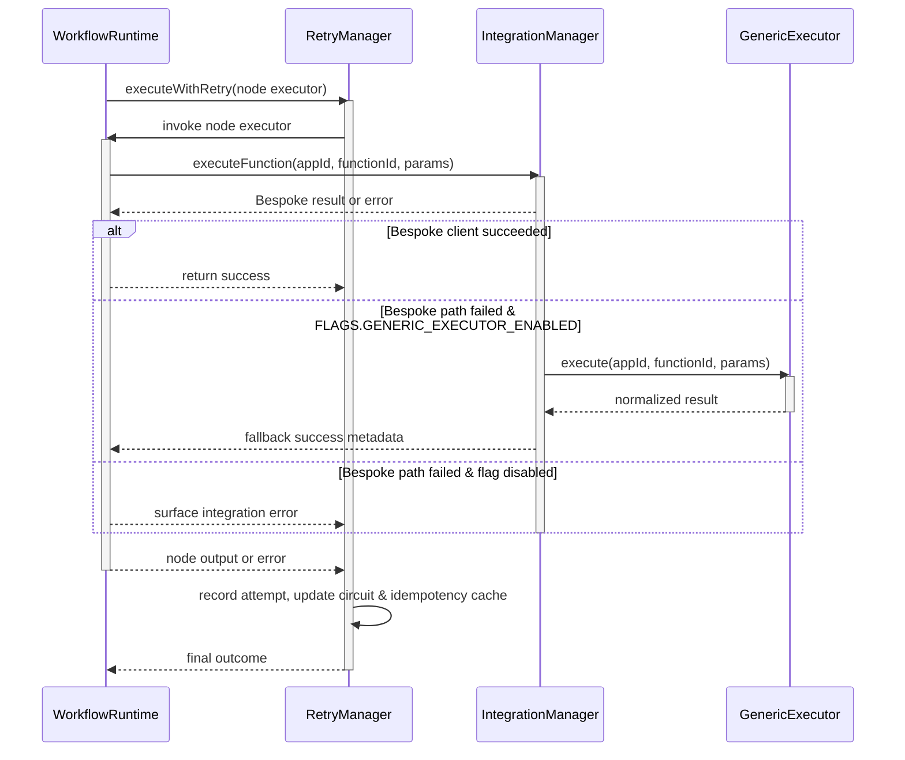

# Workflow Runtime Interaction Guide

This document explains how the workflow execution stack coordinates the **WorkflowRuntime**, **IntegrationManager**, **GenericExecutor**, and **RetryManager** components when running a node. It highlights how fallbacks and retries are orchestrated and when the `FLAGS.GENERIC_EXECUTOR_ENABLED` feature flag changes behavior.

## Execution Flow Overview

1. **WorkflowRuntime** resolves node metadata, prepares credentials, and generates an idempotency key before delegating execution to `RetryManager.executeWithRetry` so that every attempt is tracked and deduplicated.【F:server/core/WorkflowRuntime.ts†L498-L561】【F:server/core/RetryManager.ts†L360-L419】
2. **RetryManager** looks for cached results, enforces retry policy, and applies circuit breaker state per connector. It invokes the node executor (provided by WorkflowRuntime) and persists the most recent outcome for observability and idempotent replays.【F:server/core/RetryManager.ts†L360-L479】
3. **IntegrationManager** resolves the connector module via `ConnectorFramework`, validates the payload against the module contract, and routes the request through `module.execute`. If the bespoke module is unavailable or fails, the manager can defer to the generic path when feature flags allow it.【F:server/connectors/ConnectorFramework.ts†L320-L430】【F:server/integrations/IntegrationManager.ts†L248-L364】
4. **GenericExecutor** executes OpenAPI/JSON manifest-driven requests, normalizes responses, and returns control to IntegrationManager so WorkflowRuntime can record metadata (including which executor ran).【F:server/core/WorkflowRuntime.ts†L575-L610】
5. **RetryManager** captures the successful result (or propagates the failure) and updates circuit state and actionable error logs for downstream monitoring.【F:server/core/RetryManager.ts†L420-L479】

## Sequence Diagram

## Feature Flag Behavior

- `FLAGS.GENERIC_EXECUTOR_ENABLED` mirrors the `GENERIC_EXECUTOR_ENABLED` environment variable and unlocks fallback execution through GenericExecutor when bespoke clients fail or are missing.【F:server/env.ts†L143-L148】【F:server/integrations/IntegrationManager.ts†L231-L418】
- WorkflowRuntime checks the flag before triggering a fallback so that environments without the generic executor continue to fail fast when bespoke implementations are required.【F:server/core/WorkflowRuntime.ts†L575-L610】

## Operational Considerations

- **Idempotency & persistence:** RetryManager stores successful results keyed by node idempotency values, letting reruns skip rework when a node has already produced an output.【F:server/core/RetryManager.ts†L360-L419】
- **Circuit breakers:** Each connector/node pair has independent failure thresholds so noisy integrations can trip into cooldown without impacting other nodes.【F:server/core/RetryManager.ts†L360-L447】
- **Metadata capture:** WorkflowRuntime attaches executor type, execution time, and fallback reason to node metadata, making it easier to audit when the generic path was used.【F:server/core/WorkflowRuntime.ts†L598-L610】
- **Observability hooks:** RetryManager emits actionable error events so operators can alert on repeated fallbacks or rate limiting before end users feel the impact.【F:server/core/RetryManager.ts†L420-L479】

Use this flow as a reference when adding new connector features or adjusting retry/fallback policies so that changes remain compatible with the runtime’s orchestration guarantees.
